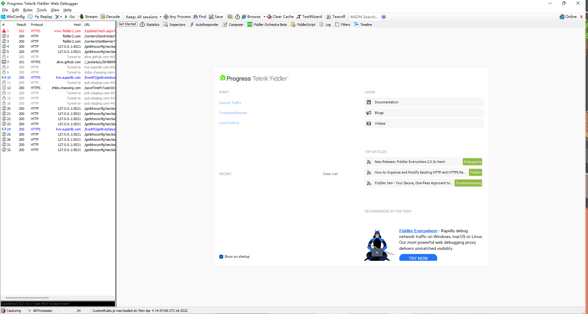
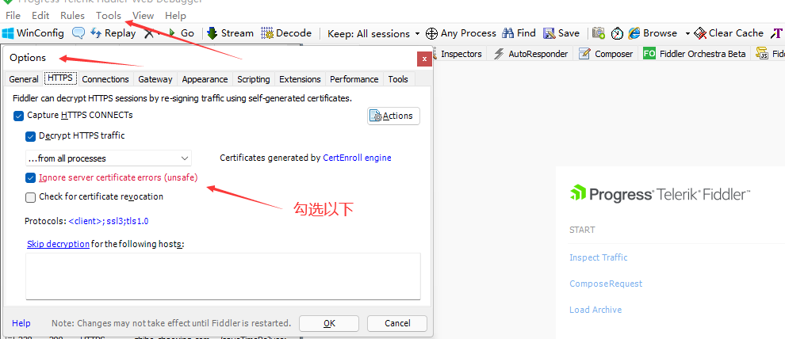
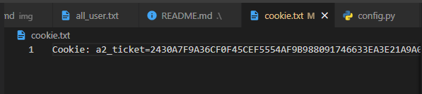

# 腾讯课堂直播监听

## 功能介绍

- 清点学生
  - 发送命令 `学生`
- 随机抽选学生
  - 发送命令 `抽选`
- 保存直播间图片
  - 直播时都会将直播间所发送的图片保存在 `data/image` 路径下
- 保存直播间发言记录
  - 直播时学生的发言都会保存在 `data/speak` 路径下，在关闭程序后才会保存

## 部署
1. 在  `__init__.py` 同目录下创建一个`cookie.txt`文件夹，用于存放用户的`cookie`，可以通过 [Fiddler](https://www.telerik.com/download/fiddler) 软件进行抓包得到。
2. 新建`ClassStudents.xlsx`的文件，里面用于存放学生姓名与班级名称。例如:

| 班级1 | 班级2 |
|:---:|:---:|
| 学生1 | 学生1 |
| 学生2 | 学生2 |


### 安装依赖模块
```shell
pip install aiohttp pandas openpyxl
```

### 运行
```shell
python __init__.py
```

## Fiddler如何抓包与使用

打开Fiddler



勾选https请求



对带qq的域名进行抓包，并且查看 `headers` 中是否存在 `cookie` 存在则鼠标右击 `cookies` 选择 `copy header`


粘贴到 `cookie.txt`

