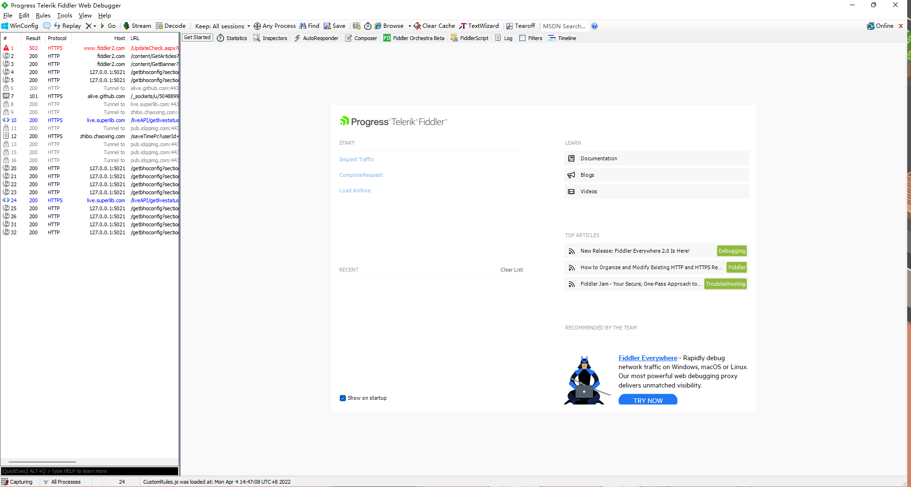
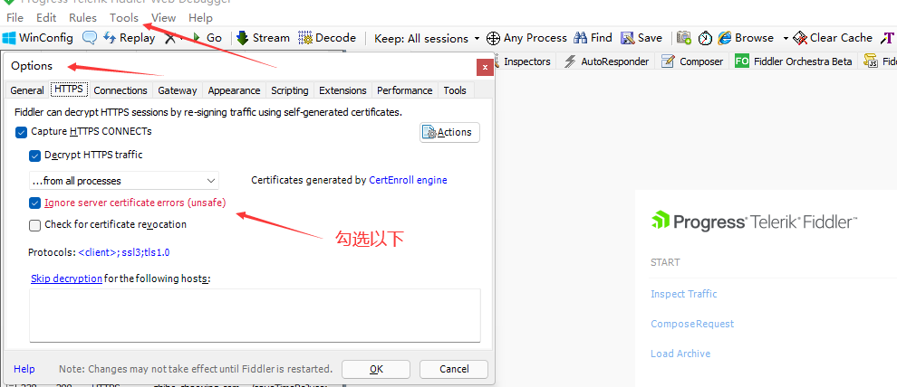
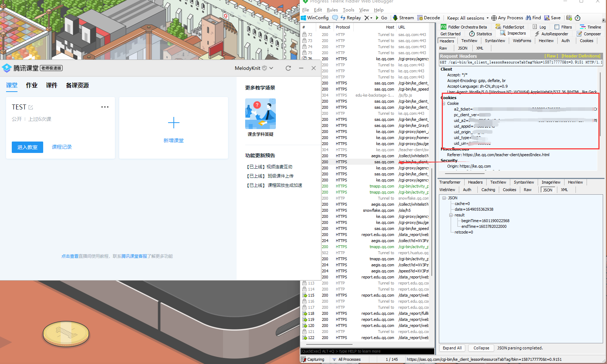

# 腾讯课堂直播监听

## 部署
1. 在  `__init__.py` 同目录下创建一个`cookie.txt`文件夹，用于存放用户的`cookie`，可以通过 [Fiddler](https://www.telerik.com/download/fiddler) 软件进行抓包得到。
2. 新建`all_user.txt`的文件，里面用于存放学生姓名，用空格或者回车分割例如`张三 李雷 小明`
3. 修改 `config.py` room_id为自己直播课堂的id

### 安装依赖模块
```shell
pip install aiohttp
```

### 运行
```shell
python __init__.py
```

## Fiddler如何抓包与使用

打开Fiddler



勾选https请求



对带qq的域名进行抓包，并且查看 `headers` 中是否存在 `cookie` 存在则鼠标右击 `cookies` 选择 `copy header`

